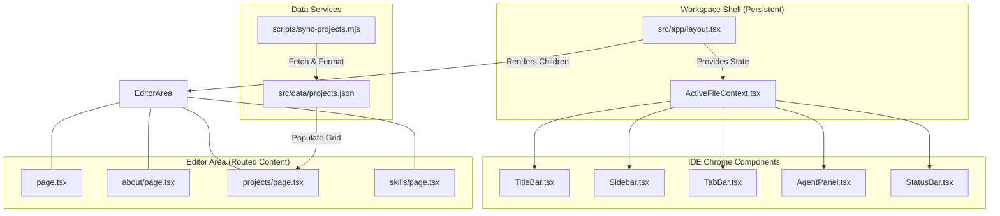

# 🌌 Antigravity IDE Portfolio

An immersive, high-fidelity developer portfolio designed to look and feel exactly like a modern IDE. Built for developers who want their work to be explored in its natural habitat.

---

## 🚀 Concept: The Portfolio as an IDE

Unlike traditional portfolios, **Antigravity IDE** treats every section as a "file" in a coding environment. Navigation doesn't just change the page; it opens a new tab, updates the breadcrumbs, and highlights the file tree—mimicking the daily workflow of a software engineer.

### Key Features
- **Interactive File Explorer:** Navigate through "Home," "About," "Projects," and "Skills" as if they were files in a repository.
- **System Architecture Viewer:** Explore deep-dive logic with interactive, zoomable **Mermaid.js** diagrams for every major project.
- **Agent Manager:** A resizable AI-assistant panel (Gemini 1.5 Flash) that provides context and planning information.
- **Automated Sync:** A custom synchronization engine that pulls real-time repository data, stars, and forks directly from the GitHub API.
- **VS Code Aesthetic:** Meticulously crafted UI using a custom Tailwind theme that matches the VS Code Dark+ color palette.

---

## 🛠️ Tech Stack

- **Core:** [Next.js 14](https://nextjs.org/) (App Router), [TypeScript](https://www.typescriptlang.org/)
- **UI & Animation:** [Tailwind CSS](https://tailwindcss.com/), [Framer Motion](https://www.framer.com/motion/)
- **Visuals:** [Mermaid.js](https://mermaid.js.org/) (Architecture), [Lucide React](https://lucide.dev/) (Icons)
- **State Management:** React Context API (Active File Tracking)
- **Data:** GitHub REST API (Automated Project Syncing)

---

## System Architecture



---

## 🏗️ Getting Started

### 1. Installation
```bash
git clone https://github.com/singhaganesh/Antigravity-IDE-Portfolio.git
cd Antigravity-IDE-Portfolio
npm install
```

### 2. Synchronization
To update the project list with your latest GitHub repositories:
```bash
# This fetches data from your GitHub profile and updates projects.json
node scripts/sync-projects.mjs
```

### 3. Local Development
```bash
npm run dev
```
Open [http://localhost:3000](http://localhost:3000) to view the IDE.

---

## 📂 Project Structure

- `src/app/` — Next.js App Router (each folder is a "file" in the IDE).
- `src/components/ide/` — The core "Chrome" components (Sidebar, TitleBar, etc.).
- `src/context/` — Global state for managing open tabs and active files.
- `src/data/` — Static profile data and cached GitHub project data.
- `scripts/` — Automation tools for keeping the portfolio up to date.

---
*Created with ❤️ by Ganesh Singha*
